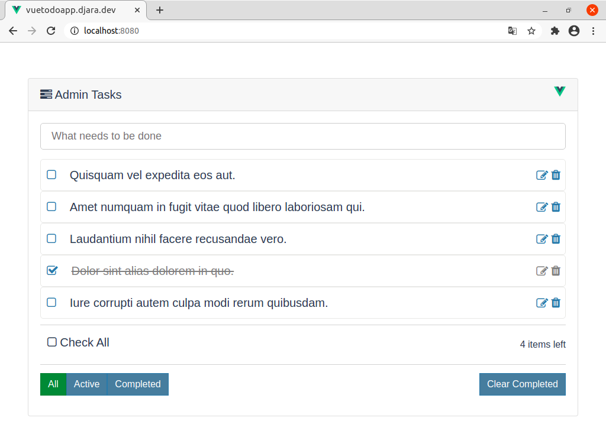

#### vueapptasks

# Aplicación Administracion de tareas, integrando con API Rest en Laravel

### Descripción

```
En esta aplicacion, se realizan prácticas usando el framework de Vue y controlando los estados con vuex.
Además establecemos una conexion con la Base de datos en Mysql y ApiRest en Laravel.

```

## Frontend de la Aplicacion



### Compila y recarga los archivos en modo Desarrollo

```
npm run serve
```

### Despliegue de App en Producción

```
npm run build
```

### App Online en Netlify
[Ver Demo Aqui][1]

[1]: https://youthful-roentgen-257a07.netlify.app/

